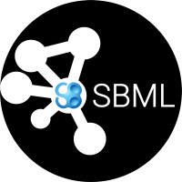

# cy3sbml - SBML for Cytoscape 3

**cy3sbml** is a [Cytoscape](http://www.cytoscape.org) app for the import and work with SBML files providing amongst others the 
visualization of SBML network annotations within the network context.  
SBML models can be imported from BioModels.net or via file or urls. One click access to the annotation
resources is provided. SBML validation information about the imported files is available.

We are currently porting all features from the Cytoscape 2 plugin to Cytoscape 3.

**Status** : alpha  
**Support & Forum** : https://groups.google.com/forum/#!forum/cysbml-cyfluxviz  
**Bug Tracker** : https://github.com/matthiaskoenig/cy3sbml/issues  

## Features (first beta release)
* Java based SBML parser for Cytoscape based on JSBML (http://sourceforge.net/projects/jsbml/)
* access to models and annotations via BioModel 
  (http://www.biomodels.org/) and MIRIAM WebServices (http://www.ebi.ac.uk/miriam/main/)
* supports all versions of SBML
* SBML validation (SBML warnings and errors accessible)
* Standard network layout based on the species/reaction model
* Provides access to RDF based annotation information within
  the network context
* Navigation menu based on the SBML structure linked to layout 
  and annotation information
* succesfully tested with all SBML.org and Biomodels.org test
  cases (sbml-test-cases-2.0.2, BioModels_Database-r28)

## License
* Source Code: [GPLv3](http://opensource.org/licenses/GPL-3.0)
* Documentation: [CC BY-SA 4.0](http://creativecommons.org/licenses/by-sa/4.0/)

## Installation
* Download and install the latest version of [Cytoscape](http://www.cytoscape.org/) (>=3.2.1).  
* Clone the repository (`git clone https://github.com/matthiaskoenig/cy3sbml.git`).  
For the **stable release** checkout the master branch (`git checkout master`).  
For the **development release** checkout the develop branch (`git checkout -b develop origin/develop`).
* To install cy3sbml as app within Cytoscape, go to the menu bar and choose `Apps → App Manager → Install Apps`. Select `Install from File` and use the `cy3sbml-*.jar` located in the `cy3sbml/target/` folder.

After installation cy3sbml will be listed in the `Currently Installed` apps tab.

### Building from source
To build from source follow the instructions in `doc/cy3sbml_build_instructions.pdf`.

### Uninstall
To uninstall or disable cy3sbml, go to the menu bar and choose `Apps → App Manager → Currently Installed`. Select cy3sbml and click `Uninstall` or `Disable`.

## Funding
We are funded by the [NRNB](http://nrnb.org) (National Resource for Network Biology) within the [NRNB Academy Summer Session](http://nrnb.org/gsoc.html). 

----
&copy; 2015 Matthias König. Developed and maintained by Matthias König, Andreas Dräger and Nicolas Rodriguez.
