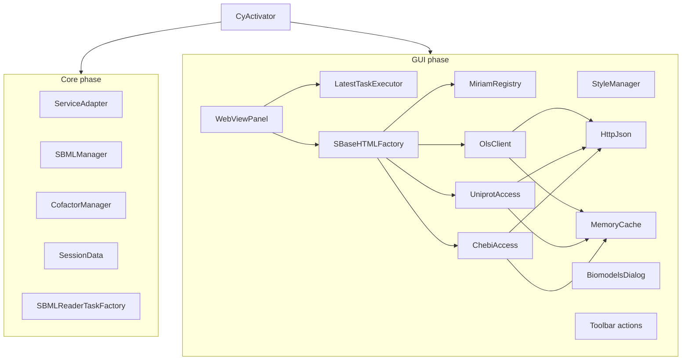
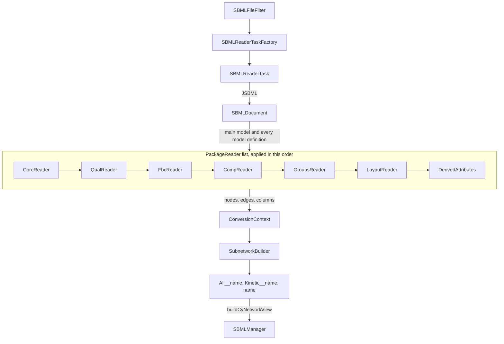

# Architecture

All code is in the package `org.cy3sbml` (`src/main/java/org/cy3sbml/`). This page
describes the main parts and how they are connected.

## Startup

`CyActivator` is the OSGi bundle activator and the only place where objects are created
and connected. It gets the Cytoscape services, creates the managers, readers, panel and
actions, and registers them as OSGi services. New actions and listeners are added here.

The start runs in two phases:

1. **Core:** the properties, `ServiceAdapter`, `SBMLManager`, `CofactorManager`,
   `SessionData` and the SBML reader. Nothing in this phase depends
   on a resource file of the app, so the SBML reader is always registered. Without it,
   Cytoscape would pass SBML files to its own bundled SBML reader.
2. **GUI:** the bundled JavaScript extension, the extraction of the GUI resources into
   `~/CytoscapeConfiguration/cy3sbml/`, the styles, the panel and the toolbar actions.
   Each step is guarded on its own: a failure disables the feature and is logged, but
   the readers keep working.

- `ServiceAdapter` holds the Cytoscape services that actions and tasks need, so they do
  not take long constructor lists.
- `SBMLManager` maps the SUID of a root network to its `SBMLDocument`, and the `cyId` of
  every SBML object to the SUIDs of its nodes (`mapping.Network2SBMLMapper`,
  `One2ManyMapping`). All access to the SBML document of a network goes through it. It
  is registered as the OSGi service `org.cy3sbml.SBMLManager`, so other apps can use it.
- `CofactorManager` splits and merges [cofactor nodes](../guide/cofactors.md).
- `SessionData` writes the mappings of `SBMLManager` and `CofactorManager` and the SBML
  files into Cytoscape session files, and restores them when a session is loaded.
- `StyleManager` loads the visual styles from `src/main/resources/styles`.
- `ConnectionProxy` sets the Java proxy properties from the proxy settings of Cytoscape
  when the app starts. An HTTP proxy without host or port is ignored with a warning.

## Import pipeline

- `SBMLFileFilter` accepts a file if its first lines contain the SBML namespace.
- `SBMLReaderTaskFactory` creates an `SBMLReaderTask` for every file.
- `SBMLReaderTask` reads the `SBMLDocument` with JSBML. For every model source (the main
  model, every comp model definition, the model of every external model definition, and
  the flattened model from JSBML's `CompFlatteningConverter`), it creates a network and a
  `ConversionContext`, and applies the package readers in a fixed order. The location of
  the file comes from `SBMLFileFilter`, which Cytoscape calls on the same thread before it
  creates the reader.
- `org.cy3sbml.comp` resolves the references of the comp package with JSBML only:
  `CompModels` the model of a submodel (model definitions and external files, read once),
  `SBaseRefResolver` the target of a port, deletion, replaced element or replaced by.
  `SBMLManager` keeps the resolver of the reader for the info panel. A read error aborts the import with one
  `SBMLReaderError` and returns no networks.
- Every `PackageReader` (package-private, in `org.cy3sbml.reader`) converts the objects
  of one package into nodes, edges and columns. `CoreReader` uses `AttributeWriter`,
  `MathGraphBuilder` (edges from the objects referenced in math) and `UnitGraphBuilder`
  (unit definitions and units). `DerivedAttributes` runs last and adds the columns
  computed from the whole network: `compartmentCode`, `sbml type ext` and
  `shared interaction`.
- `ConversionContext` holds the state of one conversion: the network, the lookup from
  SBML ids and metaids to nodes, and the created groups. It creates the nodes of SBML
  objects and the edges between them.
- `SubnetworkBuilder` names the networks and creates the kinetic and the base network
  from the node and edge type lists in `SBML` (`kineticNodeTypes`, `coreNodeTypes`, ...).
- `buildCyNetworkView` registers the document and the node mapping in `SBMLManager`,
  applies the style and the force-directed layout.

`SBML` holds the constants for node types, edge types, column names and network prefixes.
Use them instead of string literals.

## Info panel

`WebViewPanel` is a cytopanel with a JavaFX `WebView`. It listens to selection and
network events. For every change it resolves the object to show (`PanelUpdater`) and
submits the rendering to a `LatestTaskExecutor`. The executor runs one render at a time
on its own thread. A new target cancels the pending or running render. The same target
is not rendered again while it is pending or running. Cancelling interrupts the render,
but a render can be replaced right after its last interrupt check. So every render
publishes its page with `LatestTaskExecutor.publishIfCurrent`, which checks, under the
same lock that `submit` uses, that the render is still the latest one and drops the page
otherwise. A slow web service request for an old selection therefore never replaces the
information of a newer one or the help page. The accepted pages (rendered HTML, help and
examples) reach the `Browser` through `PageLoader` in the order they were accepted, so the
page accepted last is the page shown. Rendering reads the SBML document and never changes
it.

`SBaseHTMLFactory` creates the HTML of an SBML object with the templates in
`src/main/resources/gui`. It resolves annotations with:

- `MiriamRegistry`: the identifiers.org registry. The bundled copy is used from the start,
  and replaced by the current registry after a download in the background.
- `OlsClient` (Ontology Lookup Service), `UniprotAccess` (UniProt REST API) and
  `ChebiAccess` (ChEBI). They use `HttpJson` for the HTTP requests and cache results in
  a `MemoryCache`, with a limited lifetime for "not found" results. The cache loads
  each key once: concurrent lookups of the same key share one request.

`BrowserHyperlinkListener` handles the links in the panel: app actions (examples, help,
import), selection of nodes by id, and external links, which open in the system browser.
The links are clicked on the JavaFX thread; their actions run on the Swing event dispatch
thread.

## Other packages

| Package | Content |
|---|---|
| `actions` | toolbar actions: panel, import, examples, BioModels, help, cofactors, layouts |
| `archive` | COMBINE archive reader, not functional and not registered yet (#116) |
| `biomodel` | BioModels search and import dialog |
| `cofactors` | cofactor splitting and merging |
| `layout` | saving and loading node positions as XML |
| `miriam` | identifiers.org registry |
| `ols`, `uniprot`, `chebi` | web service clients |
| `cache` | in-memory cache of the web service clients |
| `styles` | style loading, and the generation of the style files from templates |
| `util` | helpers, for example `SBMLUtil`, `AttributeUtil`, `NetworkUtil`, `ASTNodeUtil` |

`tools/pycysbml` is a separate Python (uv) package for downloading and preparing test models:
`bigg_download.py` and `biomodels_download.py` download the models of the `models` test
suite, `graph_to_sbml.py` creates `models/styles/graph.xml`. It is not part of the app build.
