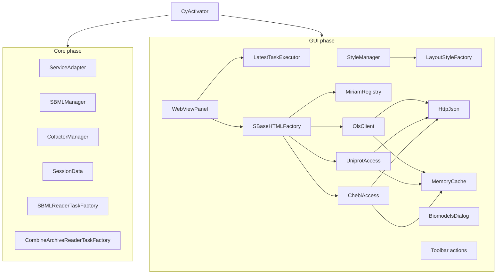
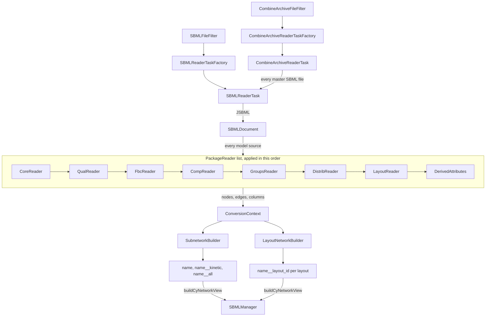

# Architecture

All code is in the package `org.cy3sbml` (`src/main/java/org/cy3sbml/`). This page
describes the main parts and how they are connected.

## Startup

`CyActivator` is the OSGi bundle activator and the only place where objects are created
and connected. It gets the Cytoscape services, creates the managers, readers, panel and
actions, and registers them as OSGi services. New actions and listeners are added here.

The start sets the log file first, so that everything that fails can be logged. Then it
runs in two phases:

1. **Core:** the properties, `ConnectionProxy`, `ServiceAdapter`,
   `SBMLManager`, `CofactorManager`, `SessionData`, the JSBML setup (`JsbmlSetup`),
   the two readers (the SBML reader and the COMBINE archive reader), the BioModels search
   and loader, and the automation commands. Nothing in this phase
   depends on a resource file of the app, so the readers are always registered. Without
   the SBML reader, Cytoscape would pass SBML files to its own bundled SBML reader.
2. **GUI:** the bundled JavaScript extension, the extraction of the GUI resources into
   `~/CytoscapeConfiguration/cy3sbml/`, then the info panel, the styles, the BioModels
   dialog and the toolbar actions. The extension and the extraction are guarded on their
   own, the panel, styles, dialog and actions together: a failure disables the feature
   and is logged, but the readers keep working.

- `ServiceAdapter` holds the Cytoscape services that actions and tasks need, so they do
  not take long constructor lists.
- `SBMLManager` maps the SUID of a root network to its `SBMLDocument`, and the `cyId` of
  every SBML object to the SUIDs of its nodes (`mapping.Network2SBMLMapper`,
  `One2ManyMapping`). It also keeps the comp resolver of every import and the COMBINE
  archive of every document imported from one. All access to the SBML document of a
  network goes through it. It is registered as the OSGi service
  `org.cy3sbml.SBMLManager`, so other apps can use it.
- `CofactorManager` splits nodes into clones, one per edge, and merges them back
  ([cofactor nodes](../guide/cofactors.md)). The clones copy the table values of the
  node, are marked by the column `cofactorClone` (a dashed border in the styles), and
  `SBMLManager.addNodeMapping` maps them to the SBML object of the node.
  `Network2CofactorMapper` keeps per network the clones of every split node, its position
  before the split and the original edge of every clone edge. The split nodes and their
  edges stay in the root network, so a merge restores the network in any order of splits
  and merges.
- `SessionData` writes the mappings of `SBMLManager` and `CofactorManager`, the COMBINE
  archives of the documents (`archives.json`) and the SBML files into Cytoscape session
  files, and restores them when a session is loaded.
- `StyleManager` loads the visual styles from `src/main/resources/styles`, and derives
  the layout style `<style>-layout` of every style in code with
  `styles.LayoutStyleFactory`.
- `ConnectionProxy` sets the Java proxy properties from the proxy settings of Cytoscape
  when the app starts, and again when they change. An HTTP proxy without host or port is
  ignored with a warning.

## Import pipeline

- `SBMLFileFilter` accepts a file if its first lines contain the SBML namespace.
- `SBMLReaderTaskFactory` creates an `SBMLReaderTask` for every file.
- `SBMLReaderTask` reads the `SBMLDocument` with JSBML. It reads one network collection
  per `ModelSource`: the main model, every comp model definition, the model of every
  external model definition, and the flattened model from JSBML's
  `CompFlatteningConverter` (named `Flat__<name>`). For every model source it creates a
  network and a `ConversionContext`, and applies the package readers in a fixed order.
  The location of the file comes from `SBMLFileFilter`, which Cytoscape calls on the same
  thread before it creates the reader; external model definitions are read relative to
  it. A read error aborts the import with one `SBMLReaderError` and returns no networks.
- `org.cy3sbml.comp` resolves the references of the comp package with JSBML only:
  `CompModels` the model of a submodel (model definitions and external files, read once;
  cycles and missing files are `Failed`), `SBaseRefResolver` the target of a port,
  deletion, replaced element or replaced by. `CompReader` writes the targets to the
  `comp_target*` columns, and `SBMLManager` keeps the resolver of the reader for the
  links of the info panel.
- Every `PackageReader` (package-private, in `org.cy3sbml.reader`) converts the objects
  of one package into nodes, edges and columns. `CoreReader` uses `AttributeWriter` (the
  columns common to all SBML objects), `MathGraphBuilder` (edges from the objects
  referenced in math) and `UnitGraphBuilder` (unit definitions and units).
  `DistribReader` writes the uncertainties of an element to the columns
  `distrib_uncertainty` and `distrib_uncertaintyCount`. `DerivedAttributes` runs last and
  adds the columns computed from the whole network: `compartmentCode`, `sbml type ext`
  and `shared interaction`.
- `ConversionContext` holds the state of one conversion: the network, the lookup from
  SBML ids and metaids to nodes, the edges of the species references, and the SBML
  groups and layouts of the model. It creates the nodes of SBML objects and the edges
  between them.
- `SubnetworkBuilder` names the networks and adds the kinetic and the base network to
  the root network, from the node and edge type lists in `SBML` (`kineticNodeTypes`,
  `coreNodeTypes`, ...). The network with all nodes and edges becomes `<name>__all`. The
  base network `<name>` comes first in the result, since Cytoscape makes the first
  network of an import the current one.
- `GroupBuilder` creates the Cytoscape groups of the SBML groups in one network: every
  network gets its own groups with its own group nodes and the members in the network.
  Cytoscape does not support one group in several networks (a session restores it with
  the members of all networks, #171).
- `LayoutReader` registers the layouts of the model in the context. After the
  subnetworks, `LayoutNetworkBuilder` creates one layout network `<name>__layout_<id>`
  per layout (#71): a node per glyph with a copy of the shared columns of the node of its
  element (aliases have the same `cyId`), the geometry in local columns (`layout_x`,
  `layout_y`, `layout_width`, `layout_height`, from `GlyphBox`), edges from the species
  reference glyphs or copied from the model edges, and small nodes for the reactions
  without glyph. A failing layout is logged and left out.
- `buildCyNetworkView` registers the document and the node mapping in `SBMLManager`,
  applies the style and the force-directed layout. The views of the layout networks get
  the positions of the glyphs and the layout style instead.
- The COMBINE archive reader (`org.cy3sbml.archive`) is registered like the SBML reader.
  `CombineArchiveFileFilter` accepts the file extensions of the COMBINE specification
  with the zip signature, but no plain `.zip` (a Cytoscape session is a zip file too).
  `CombineArchive` unpacks the archive into a directory of `ArchiveDirectories`,
  rejecting entries and manifest locations outside of it, and reads `manifest.xml` and
  `metadata.rdf` into `ArchiveInfo`. `CombineArchiveReaderTask` runs an `SBMLReaderTask`
  for every master SBML file (every SBML file if none is master) with the unpacked file
  as location, so external model definitions resolve inside the archive. The directory
  is deleted after the import. `SBMLManager` keeps the `ArchiveImport` of every root
  network for the info panel and the session.

`SBML` holds the constants for node types, edge types, column names, and the prefixes
and suffixes of the network names. Use them instead of string literals.

## Info panel

`WebViewPanel` is a cytopanel with a JavaFX `WebView`. It listens to selection and
network events. For every change it resolves the object to show (`PanelUpdater`) and
submits the rendering to a `LatestTaskExecutor`. The executor runs one render at a time
on its own thread. A new target cancels the pending or running render. The same target
is not rendered again while it is pending or running. Cancelling interrupts the render,
but a render can be replaced right after its last interrupt check. So every render
publishes its page with `LatestTaskExecutor.publishIfCurrent`, which checks, under the
same lock that `submit` uses, that the render is still the latest one and drops the page
otherwise. A slow web service request for an old selection therefore never replaces the
information of a newer one or the help page. The accepted pages (rendered HTML, help and
examples) reach the `Browser` through `PageLoader` in the order they were accepted, so the
page accepted last is the page shown. Rendering reads the SBML document and never changes
it.

`SBaseHTMLFactory` creates the HTML of an SBML object with the templates in
`src/main/resources/gui`. `ArchiveHtml` adds the COMBINE archive of a document,
`UncertaintyHtml` the distrib uncertainties of an object. Formulas show the inline units
of numbers (`util.UnitsFormulaCompiler`, #262). The annotations are resolved with:

- `MiriamRegistry`: the identifiers.org registry. The bundled copy is used from the start,
  and replaced by the current registry after a download in the background.
- `OlsClient` (Ontology Lookup Service), `UniprotAccess` (UniProt REST API) and
  `ChebiAccess` (ChEBI). They use `HttpJson` for the HTTP requests (HTTP/1.1, since
  HTTP/2 to `ebi.ac.uk` is unreliable) and cache the results in a `MemoryCache`.
  `HttpJson` tells a deterministic failure (a 4xx status other than 407, 408 and 429)
  from a transient one (a timeout, a connection failure, an empty or malformed body, a
  5xx, 407, 408 or 429 status). The cache keeps a found result until it is evicted, a
  deterministic "not found" for a short time, and a transient failure not at all, so a
  lookup after an outage asks the service again. The cache loads each key once:
  concurrent lookups of the same key share one request.

`BrowserHyperlinkListener` handles the links in the panel: app actions (import,
examples, BioModels, help, cofactors, layouts), the selection of nodes by id, metaid or
comp target (`http://select-target/<model>/<metaid>`), and external links, which open
in the system browser. The links are clicked on the JavaFX thread; their actions run on
the Swing event dispatch thread.

## Other packages

| Package | Content |
|---|---|
| `actions` | toolbar actions: panel on and off, import, examples, BioModels, help, split and merge cofactor nodes, save and load layout |
| `biomodel` | BioModels search and import dialog |
| `commands` | the automation commands in the command namespace `cy3sbml` (CyREST `/v1/commands/cy3sbml/...`), see below |
| `cofactors` | cofactor splitting and merging (`CofactorManager`, `Network2CofactorMapper`) |
| `layout` | saving and loading node positions as XML, matched by `cyId` (the SBML layout package is read in `reader`) |
| `mapping` | the mappings of `SBMLManager` (`Network2SBMLMapper`, `One2ManyMapping`) |
| `miriam` | identifiers.org registry |
| `ols`, `uniprot`, `chebi` | web service clients |
| `cache` | in-memory cache of the web service clients |
| `styles` | style loading, the layout styles (`LayoutStyleFactory`), and the generation of the style files `cy3sbml*.xml` from the templates and `StyleInfo*` (`StyleFactory.createStyle`) |
| `util` | helpers, for example `SBMLUtil`, `AttributeUtil`, `NetworkUtil`, `ASTNodeUtil`, `HttpJson` |

## Automation commands

`commands.Commands` is the registry of the commands (name, descriptions, example JSON, task
factory); `CyActivator` registers each factory as a `TaskFactory` service with the command
service properties (`COMMAND_NAMESPACE` `cy3sbml`, `COMMAND`, `COMMAND_SUPPORTS_JSON`, ...)
in the core phase, so the commands work without the GUI. The tasks take their arguments as
`@Tunable` fields, which Cytoscape sets by reflection, so the task classes and their tunable
members are public (`CommandsTest` checks it). They extend `JsonTask`, an `ObservableTask`
with the result as `JSONResult` for CyREST and as `String` for the command line, written
with Jackson. The services come as `CommandServices`.

The commands reuse the logic of the GUI: `import` runs the Cytoscape network loaders (or
`BiomodelLoader`) in the `SynchronousTaskManager`, so the result of the command is only
the result of cy3sbml, and returns the new networks grouped by root network; the other
commands use `SBMLManager`, `BiomodelsQuery`, `CofactorManager` (with `CofactorViews`,
shared with the toolbar actions) and `LayoutTools`. The type of a network in the results is
the network column `sbmlSubnetwork`, which `SubnetworkBuilder` and `LayoutNetworkBuilder`
set. The user documentation is `docs/guide/automation.md`; `CommandsTest` checks that every
command is documented there. The Python examples are in `examples/python` (py4cytoscape).

`tools/pycysbml` is a separate Python (uv) package that downloads and writes test models,
see [Testing](testing.md#test-models). It is not part of the app build.
