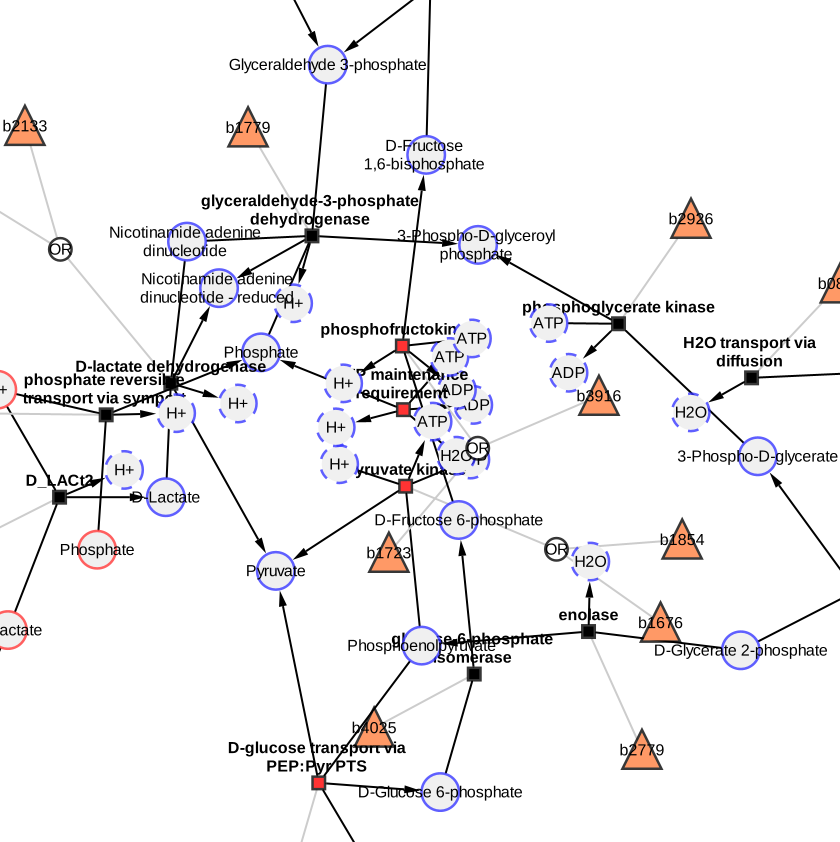

# Cofactor nodes

Cofactors like ATP, ADP, NAD or water take part in many reactions. In the network, their
nodes connect to many reactions, which pulls the layout together and hides the structure
of the pathway. cy3sbml splits such nodes into one node per edge, and merges them back.

## Split cofactor nodes

1. Select one or more nodes in a network imported by cy3sbml.
2. Click **Split cofactor nodes** in the toolbar.

Every selected node with N edges is replaced by N clones. Every clone has one of the
edges of the node, a copy of its table values and is placed next to the node at the other
end of its edge, in the direction of the split node; the clones at one node are spread so
that they do not overlap. The clones are drawn with a dashed border and have the value
`true` in the column `cofactorClone`. The info panel shows the SBML element of the node
for its clones.

{ width="600" }

Nodes with fewer than two edges, group nodes and clones are not split.

## Merge cofactor nodes

1. Select one or more clones, or nothing.
2. Click **Merge cofactor nodes** in the toolbar.

The clones of every node with a selected clone are merged into the node. If no clone is
selected, all split nodes of the network are merged. The node gets its edges and its
position before the split back, so splitting and merging leaves the network unchanged,
also if nodes connected to each other (for example a species and its compartment in the
`__all` network) are split and merged in any order.

## Notes

- The buttons are enabled only if the current network was imported by cy3sbml. The help
  page of the info panel has links to both actions.
- Splitting and merging only change the current network, the other networks of the model
  are not changed.
- The split nodes of every network are saved in Cytoscape sessions and restored when the
  session is opened.
- The clones have the `cyId` of their node. [Load Layout](layouts.md#save-and-load-node-positions)
  therefore moves all clones of a node to the same position.
