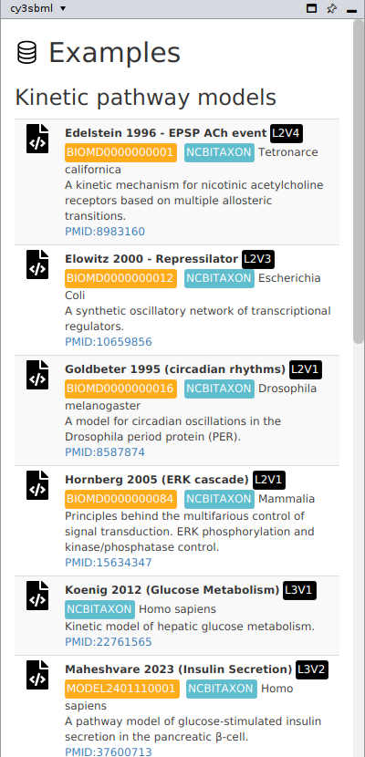
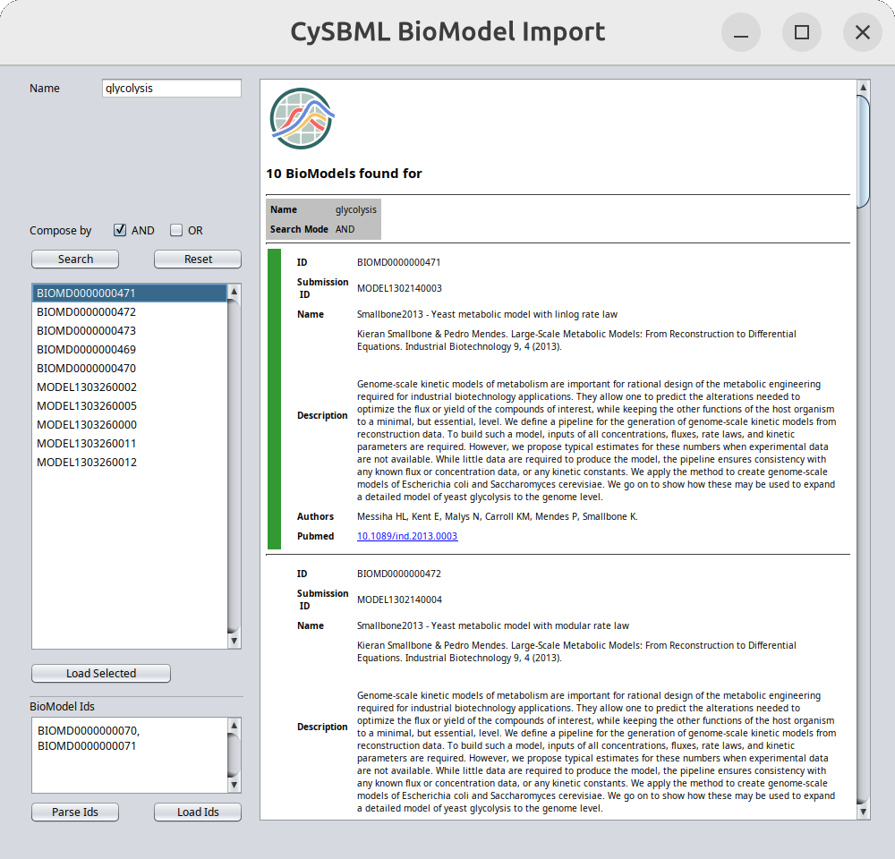

# Importing SBML

cy3sbml registers an SBML reader in Cytoscape. Every way of loading a network file in
Cytoscape uses it for SBML files. An import creates three networks per model, see
[Network model](network.md).

## Which files are read as SBML

A file is read by cy3sbml if its first 20 lines contain the SBML namespace
`http://www.sbml.org/sbml/`, whatever its file extension. The file dialog of
**Import SBML** lists files with the extensions `.xml` and `.sbml` and files without
extension. All SBML levels and versions are supported.

The file is decoded with the encoding declared in its XML declaration (UTF-8 if none is
declared).

## Import SBML files

Use one of these ways:

- Click **Import SBML** in the toolbar and select one or more files. Every selected file
  is imported.
- Use the Cytoscape menu **File → Import → Network from File...**.
- Drag SBML files onto the network panel of Cytoscape.
- Load a file with the Cytoscape automation interface (CyREST), for example the command
  `network load file file=<path>`.

After the import, cy3sbml applies its visual style and the force-directed layout to every
network view. See [Styles](styles.md) and [Layouts](layouts.md).

## Example models

Click **SBML examples** in the toolbar. The cy3sbml panel shows a list of example models,
which are part of the app. Click the import icon of an example to load it. The examples
cover:

- kinetic pathway models from BioModels (for example Edelstein 1996, `BIOMD0000000001`, and
  the repressilator, `BIOMD0000000012`), and models of hepatic glucose metabolism and
  insulin secretion,
- physiologically based pharmacokinetic (PBPK/PD) models of glimepiride and rivaroxaban,
  with their liver, kidney and intestine submodels, which use the `comp` package,
- qualitative signaling models (`qual` package),
- constraint-based models (`fbc` package) from BiGG, for example `e_coli_core`.

{ width="400" }

## BioModels

Click **Biomodel Import** in the toolbar to open the BioModels dialog. It loads models
from [BioModels](https://www.ebi.ac.uk/biomodels/) in two ways:

- **Search:** enter a term in **Name**, click **Search**, select one or more models in
  the result list, and click **Load Selected**. Only the first page of search results is
  read.
- **By identifier:** type or paste text with BioModels identifiers (`BIOMD` or `MODEL`
  followed by 10 digits, or `BMID` followed by 12 digits) into **BioModel Ids**.
  **Parse Ids** lists the identifiers found in the text with their model information,
  **Load Ids** loads the models.

The SBML of every model is downloaded and imported like a file.

!!! warning "Known problem"

    BioModels moved to `https://biomodels.org`, and the old addresses answer with a
    redirect. The BioModels dialog of cy3sbml 0.5.1 does not handle this: a search finds
    no models, and loading by identifier reports "No SBML could be loaded". Until this
    is fixed, download the SBML file from the BioModels website and import it as a file.

The dialog lists further search fields (person, publication, ChEBI, UniProt) in its help
text, but only the name field is available.

## Several models in one file

A file with the `comp` package can hold model definitions in addition to the main model.
cy3sbml creates the three networks for the main model and for every model definition.
External model definitions are not loaded, see
[Supported SBML packages](packages.md#comp-hierarchical-model-composition).

## COMBINE archives

The toolbar has a button **Import Archive (COMBINE & ResearchObjects)**, and cy3sbml
registers a reader for archive files. Reading the content of an archive is not
implemented yet ([issue #116](https://github.com/matthiaskoenig/cy3sbml/issues/116)):
importing an archive creates no model networks. Extract the SBML files from the archive
and import them as files.

## Errors while reading

If a file cannot be read, for example because it is not well-formed XML, Cytoscape shows
the error of cy3sbml. The message names the file, a short cause with the line in the file
for XML errors, and a link to the SBML validator. No network is created for such a file.
See [Validation](validation.md).
