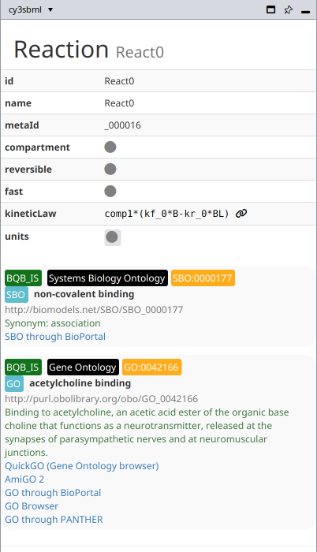
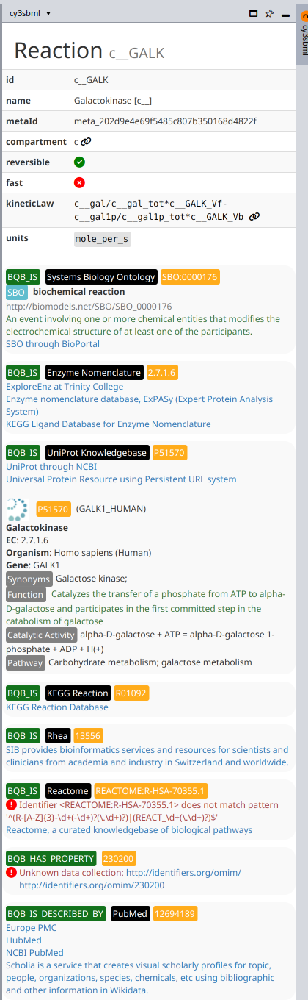

# Info panel and annotations

The **cy3sbml** panel on the right side of the Cytoscape window shows the SBML
information of the selected object. Click **Hide|show panel** in the toolbar to hide or
show it.

## What the panel shows

The panel follows the selection in the current network:

- If no node is selected, it shows the SBML document and the model.
- If nodes are selected, it shows the SBML object of the first selected node.
- Some nodes have no SBML object, for example the `AND` and `OR` nodes of fbc gene
  associations, or base units like `mole` that are not defined in the model. The panel
  then shows "No information".
- If the current network was not imported by cy3sbml, the panel shows that no SBML
  document is associated with it.

For the selected object, the panel shows in this order:

1. The SBML class and the id, for example **Reaction** `React0`.
2. A table with the SBML attributes of the object, for example the formula of the kinetic
   law of a reaction, or the initial values of a species. Ids of referenced objects,
   for example the compartment of a species, have a link icon. Clicking it selects the
   node of the referenced object.
3. The model history: creators with email and organisation, the creation date and the
   modification dates.
4. The annotations (see below).
5. Annotations that are not RDF, for example SABIO-RK data, as formatted XML.
6. The notes.

Links to external web pages open in the web browser of the system.

{ width="400" }

## Annotations

cy3sbml shows the controlled vocabulary (CV) terms of the RDF annotation, and the SBO
term of the object as an annotation with the qualifier `BQB_IS`. For every resource of a
CV term, the panel shows:

- the qualifier, for example `BQB_IS` or `BQB_IS_DESCRIBED_BY`,
- the name of the data collection, for example **Gene Ontology**, and the identifier,
  which links to the first resource of the collection,
- links to all resources of the collection that are not deprecated, for example
  QuickGO and AmiGO 2 for Gene Ontology terms,
- the term information from the web services listed below.

Resource URIs are resolved with the [identifiers.org](https://identifiers.org) registry
(MIRIAM). Both URI forms are resolved, for example
`https://identifiers.org/GO:0042166` and `http://identifiers.org/go/GO:0042166`.

The panel warns about two annotation problems:

- **Identifier does not match pattern**: the identifier does not match the identifier
  pattern of the collection in the registry.
- **Unknown data collection**: the collection of the URI is not in the registry. The
  panel then shows the plain URI.

### Web services

| Service | Used for | Shown information |
|---|---|---|
| [identifiers.org registry](https://registry.identifiers.org) | all resources | collection name, identifier pattern, resource links |
| [Ontology Lookup Service](https://www.ebi.ac.uk/ols4/) (OLS4) | ontology terms, for example GO, SBO, ChEBI, NCBITaxon | term label, description, synonyms |
| [UniProt](https://www.uniprot.org) REST API | `uniprot` resources | protein name, EC number, organism, gene, synonyms, function, catalytic activity, pathway |
| [ChEBI](https://www.ebi.ac.uk/chebi/) | `chebi` resources | formula, charge, mass, structure image |

The registry is part of the app, so annotations are resolved without network access.
After the start of Cytoscape, cy3sbml downloads the current registry from identifiers.org
in the background and uses it once the download is complete.

The results of OLS, UniProt and ChEBI are cached in memory while Cytoscape runs, so
selecting an object again does not repeat the requests. Terms that were not found are
cached for a limited time, then requested again.

{ width="400" }

## Annotations as table columns

The import also stores the annotations in the node table, one column per data collection.
See [Network model](network.md#table-columns).
