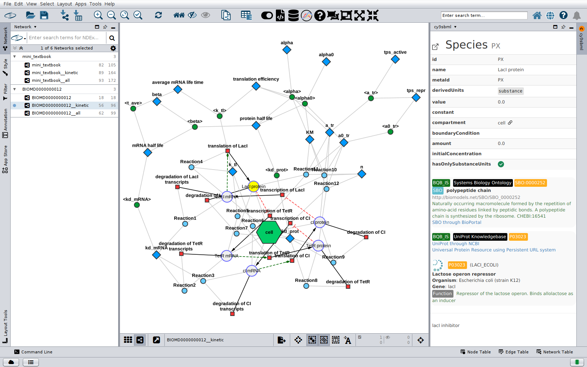

# Network model

cy3sbml converts every SBML object into a node, and the relations between the objects
into edges. This page describes the networks, node types, edge types and table columns
that an import creates.

## Networks

For every model, the import creates one network collection (root network) with three
networks. `<name>` is the model id, or the file name if the model has no id.

| Network | Content |
|---|---|
| `<name>` | The base network: species, reactions, qualitative species and transitions, and the fbc gene products and gene associations, with the reactant, product, modifier, transition and association edges. SBML groups are added as Cytoscape groups. |
| `Kinetic__<name>` | The kinetic network: the base network plus compartments, parameters, rules, initial assignments, kinetic laws, local parameters, function definitions and comp ports, replacements and deletions, with the edges of the math that references them. |
| `All__<name>` | All nodes and edges: the kinetic network plus events, constraints, unit definitions and units, and comp submodels. |

The `comp` package can define several models in one file, and refer to models in other
files. Every model gets its own network collection: the main model, every model
definition and every external model. The flattened model of a model with submodels gets
the collection `Flat__<name>`, with the networks `Flat__<name>`,
`Kinetic__Flat__<name>` and `All__Flat__<name>`.

## Node types

The type of a node is in the column `sbml type`.

| `sbml type` | SBML object | Networks |
|---|---|---|
| `species` | Species | base, kinetic, all |
| `reaction` | Reaction | base, kinetic, all |
| `compartment` | Compartment | kinetic, all |
| `parameter` | Parameter | kinetic, all |
| `kineticLaw` | KineticLaw | kinetic, all |
| `localParameter` | LocalParameter | kinetic, all |
| `rateRule`, `assignmentRule`, `algebraicRule` | Rules | kinetic, all |
| `initialAssignment` | InitialAssignment | kinetic, all |
| `functionDefinition` | FunctionDefinition | kinetic, all |
| `event`, `eventAssignment` | Event, EventAssignment | all |
| `constraint` | Constraint | all |
| `unitDefinition`, `unit` | UnitDefinition, Unit | all |
| `qual_species` | QualitativeSpecies (qual) | base, kinetic, all |
| `qual_transition` | Transition (qual) | base, kinetic, all |
| `fbc_geneProduct` | GeneProduct (fbc) | base, kinetic, all |
| `fbc_and`, `fbc_or` | And, Or of a gene product association (fbc) | base, kinetic, all |
| `comp_submodel` | Submodel (comp) | all |
| `comp_port` | Port (comp) | kinetic, all |
| `comp_replacedElement`, `comp_replacedBy` | ReplacedElement, ReplacedBy (comp) | kinetic, all |
| `comp_deletion` | Deletion (comp) | kinetic, all |
| `group` | Group (groups) | as Cytoscape group in base and kinetic |

The column `sbml type ext` refines the type for the visual style: reactions are
`reaction reversible` or `reaction irreversible`.

## Edge types

The type of an edge is in the column `interaction type`. All edges are directed.

| `interaction type` | From | To |
|---|---|---|
| `reaction-reactant` | reaction | reactant species |
| `reaction-product` | reaction | product species |
| `reaction-modifier` | reaction | modifier species |
| `species_compartment` | species or qualitative species | compartment |
| `reaction_compartment` | reaction | compartment |
| `reaction_kineticLaw` | reaction | kinetic law |
| `localParameter_kineticLaw` | local parameter | kinetic law |
| `reference_kineticLaw` | object referenced in the math | kinetic law |
| `variable_rule`, `reference_rule` | rule variable, object referenced in the math | rule |
| `variable_initialAssignment`, `reference_initialAssignment` | assigned variable, object referenced in the math | initial assignment |
| `trigger_event`, `priority_event`, `delay_event` | object referenced in the trigger, priority or delay | event |
| `variable_eventAssignment`, `reference_eventAssignment` | assigned variable, event or object referenced in the math | event assignment |
| `unit_unitDefinition` | unit | unit definition |
| `sbase_unitDefinition` | object with units | unit definition |
| `parameter_reaction` | flux bound parameter (fbc) | reaction |
| `input_transition` | transition | input qualitative species |
| `transition_output` | transition | output qualitative species |
| `species_geneProduct` | associated species | gene product (fbc) |
| `association_reaction` | gene product or top and/or node of the association | reaction (fbc) |
| `association_association` | gene product or and/or node | the and/or node it belongs to (fbc) |
| `sbaseRef-id`, `sbaseRef-metaId`, `sbaseRef-unit`, `sbaseRef-port` | comp port, deletion, replacedElement or replacedBy node | referenced element in the same model |
| `sbaseRef-submodel` | comp replacedElement or replacedBy node | its submodel |
| `sbase-deletion` | comp submodel, or replacedElement of a deletion | deletion |
| `sbase-replacedElement`, `sbase-replacedBy` | element with the replacement | its replacedElement or replacedBy node |

The column `shared interaction` refines the type for the visual style: a modifier edge
whose SBO term is an inhibitor term (for example SBO:0000020) is `reaction-inhibitor`,
one with an activator or catalyst term (for example SBO:0000459 or SBO:0000013) is
`reaction-activator`.

## Table columns

These columns are set on nodes, when the SBML object has the value:

| Column | Content |
|---|---|
| `sbml id` | SBML id (units and unit definitions use `unitSid`, ports use `portSid`) |
| `shared name`, `name` | SBML name |
| `label` | name, or id if the object has no name; the node label of the style |
| `metaId` | SBML metaid |
| `sbo` | SBO term, for example `SBO:0000247` |
| `cyId` | unique id that maps the node to its SBML object |
| `sbml compartment` | compartment of a species or reaction |
| `compartmentCode` | number of the compartment (1, 2, ...), used for the border color |
| `sbml initial concentration`, `sbml initial amount`, `sbml charge` | species values |
| `boundaryCondition`, `hasOnlySubstanceUnits`, `conversionFactor` | species attributes |
| `constant`, `value`, `units`, `derivedUnits` | attributes of quantities |
| `size`, `spatialDimensions` | compartment attributes |
| `reversible`, `fast`, `kineticLaw` | reaction attributes; `kineticLaw` holds the formula |
| `math` | formula of rules, assignments, kinetic laws and function definitions |
| `variable` | variable of a rule or assignment |
| `stoichiometry` | stoichiometry, on reactant and product edges |
| `sbml id`, `shared name`, `metaId`, `sbo` | on reactant, product and modifier edges: the attributes of the species reference |
| `kind`, `exponent`, `scale`, `multiplier` | unit attributes |

Package columns:

- `qual`: `qual_initialLevel`, `qual_maxLevel`, `qual_sign`, `qual_tresholdLevel`,
  `qual_transitionEffect`, `qual_qualitativeSpecies`, `qual_outputLevel`,
  `qual_resultLevels`.
- `fbc`: `fbc_strict` (network table), `fbc_charge` and `fbc_chemicalFormula` (species),
  `fbc_lowerFluxBound` and `fbc_upperFluxBound` (reactions), and one column
  `fbc_objective-<objective id>` per objective with the objective coefficient of the
  reactions.
- `comp`: `comp_portRef`, `comp_idRef`, `comp_unitRef`, `comp_metaIdRef`,
  `comp_sBaseRef`, `comp_submodelRef`, `comp_conversionFactor`, `comp_deletion`,
  `comp_modelRef`, `comp_timeConversionFactor`, `comp_extentConversionFactor`, and the
  resolved target `comp_targetModel`, `comp_targetId`, `comp_targetType`,
  `comp_targetMetaId` with `comp_resolution`.
- `distrib`: `distrib_uncertainty` and `distrib_uncertaintyCount` on the node of every
  element with uncertainties, and on the edges of species references. See
  [distrib](packages.md#distrib-distributions).

Annotations become columns too. Every resource of an RDF annotation is stored in a column
named after its identifiers.org collection, with the identifier as value. For models with
the `fbc` package, the `KEY: value` paragraphs in the notes of species, reactions and gene
products (the COBRA notes format, for example `GENE_ASSOCIATION`) are stored as columns
named `KEY`.

The network table has the columns `sbmlNetwork` and `sbmlVersion`.

## Mapping to the SBML document

cy3sbml keeps the SBML document of every imported network, and maps every node to its
SBML object with the `cyId` column. The [info panel](info-panel.md) uses this mapping.
Networks created from an SBML network with Cytoscape functions, for example
**File → New Network → From Selected Nodes, All Edges**, keep the mapping, because they
belong to the same network collection.

The documents and mappings are saved in Cytoscape session files (`.cys`) and restored
when the session is opened.
