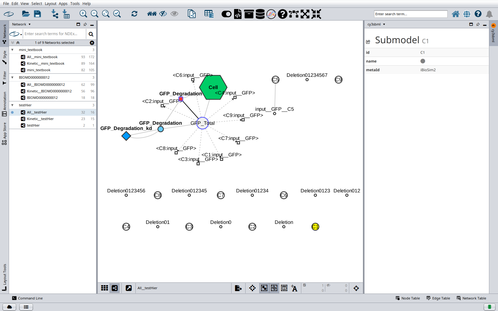

# Supported SBML packages

cy3sbml reads SBML Level 1, 2 and 3 in all versions with JSBML. The SBML core and five
Level 3 packages are converted into the network. The node and edge types of each package
are listed in [Network model](network.md).

| Package | Status |
|---|---|
| core | supported |
| `qual` (qualitative models) | supported |
| `fbc` (flux balance constraints), versions 1 and 2 | supported |
| `comp` (hierarchical model composition) | supported |
| `groups` | supported |
| `distrib` (distributions), version 1 | supported |
| `layout` | not yet supported |
| other packages, for example `multi` | read by JSBML, not converted |

## core

All core objects become nodes: compartments, species, reactions, parameters, kinetic laws
and local parameters, rules, initial assignments, function definitions, events and event
assignments, constraints, and unit definitions with their units. The math of kinetic
laws, rules, assignments and event triggers, priorities and delays becomes edges from every
referenced object to the object with the math.

## qual

Qualitative species and transitions become nodes, inputs and outputs become edges. The
levels, signs, thresholds and transition effects are stored as columns with the prefix
`qual_`.

## fbc

- Species get the columns `fbc_charge` and `fbc_chemicalFormula`.
- Reactions get the columns `fbc_lowerFluxBound` and `fbc_upperFluxBound` with the ids of
  the bound parameters, and an edge from each bound parameter. The flux bounds of fbc
  version 1 are read as well.
- Every objective becomes a column `fbc_objective-<objective id>` with the coefficients
  of its reactions. The active objective is not marked.
- Gene products become nodes. Gene product associations become a tree of `AND` and `OR`
  nodes that ends in the reaction. The gene associations of fbc version 1 are not read.
- The COBRA key value pairs in the notes, for example `GENE_ASSOCIATION`, become columns.

## comp (hierarchical model composition)

cy3sbml supports the comp package version 1 release 3.

- **Networks.** Every model of the file gets its own network collection: the main model,
  every model definition, and the model of every external model definition. External
  model definitions are read from their source, relative to the imported file (also
  sources like `file:model.xml`), over the web for `http` and `https` sources, and from
  the external files they reference in turn. If the main model has submodels, the
  flattened model is created as well, with the name `Flat__<model id>`: every submodel
  instantiated, deletions removed, replaced elements merged, and the ids prefixed with
  the submodel path (`sub1__S1`). See [Networks](network.md).
- **Nodes and edges.** Submodels, ports, deletions, replaced elements and replaced by
  elements become nodes. A submodel has an edge to each of its deletions, a replaced
  element and a replaced by element an edge from the element they belong to and one to
  their submodel. A reference to an element of the same model gets an edge to it.
- **Targets.** The target of every port, deletion, replaced element and replaced by is
  resolved, also through ports and nested `sBaseRef`s into the models of further
  submodels. The target is usually in the model of a submodel, which is another network;
  the columns `comp_targetModel`, `comp_targetId`, `comp_targetType` and
  `comp_targetMetaId` name it, and the info panel links to the node in the network of
  its model. `comp_resolution` says `resolved`, or why the target could not be found.
- **External files.** A missing or unreadable external file skips its network, and the
  flat network if a submodel instantiates its model, with a warning in the log. The location of the file is known for a file
  imported from the file system or a URL.

| comp class | Conversion |
|---|---|
| SBMLDocument (`required`, list of external model definitions, list of model definitions) | a network collection per model; the info panel of the document lists the model definitions and external model definitions with their status |
| ExternalModelDefinition (`id`, `name`, `source`, `modelRef`, `md5`) | the model is read from the source and gets a network collection; a different `md5` checksum is logged |
| ModelDefinition | a network collection |
| Model (list of submodels, list of ports) | nodes of the submodels and ports |
| Submodel (`id`, `name`, `modelRef`, `timeConversionFactor`, `extentConversionFactor`, list of deletions) | node `comp_submodel` with the columns `comp_modelRef`, `comp_timeConversionFactor`, `comp_extentConversionFactor` and the resolution of the model; edges to the deletions |
| SBaseRef (`portRef`, `idRef`, `unitRef`, `metaIdRef`, `sBaseRef`) | columns `comp_portRef`, `comp_idRef`, `comp_unitRef`, `comp_metaIdRef`, and `comp_sBaseRef` with the chain of nested references, e.g. `submodelRef=A > idRef=B > idRef=y` |
| Port (`id`, `name`, SBaseRef) | node `comp_port`, edge to the element it exposes |
| Deletion (`id`, `name`, SBaseRef) | node `comp_deletion`, target columns |
| ReplacedElement (`submodelRef`, `deletion`, `conversionFactor`, SBaseRef) | node `comp_replacedElement` with `comp_submodelRef`, `comp_deletion`, `comp_conversionFactor` and the target columns; with `deletion`, an edge to the deletion |
| ReplacedBy (`submodelRef`, SBaseRef) | node `comp_replacedBy` with `comp_submodelRef` and the target columns |
| SBase (list of replaced elements, replaced by) | on every element |

## groups

Every group becomes a Cytoscape group of the nodes of its members in the base and the
kinetic network. The SBO term, notes and annotation of a list of members are applied to
the members that do not have their own.

## distrib (distributions)

cy3sbml supports the distrib package version 1.

- **Uncertainties.** Every SBML element can have uncertainties, each with uncertainty
  parameters (for example `mean`, `standardDeviation`, a `distribution`, or an
  `externalParameter`) and spans (for example a `confidenceInterval` or a `range`).
  They do not become nodes. The node of the element gets the columns
  `distrib_uncertainty`, a summary of its uncertainties, and `distrib_uncertaintyCount`,
  their number; for a species reference, its reactant or product edge gets them. The
  summary lists the parameters of an uncertainty separated by `;`, the uncertainties
  separated by `|` and prefixed with their id, for example
  `u1: mean=4.2; confidenceInterval=[3.5, 4.9] | u2: standardDeviation=sd_k1`: a value
  with its units, a `var` (the id of the element with the value), the bounds of a span
  (`?` for a bound that is not set), or the math of a distribution, and nested parameters
  in parentheses.
- **Info panel.** The info panel of the element shows its uncertainties: the id and name
  of each uncertainty and a table with the type, value, units and definition URL of every
  parameter and span, nested parameters indented below their parent. A `var` has a link
  to the node of the element it references.
- **Distributions in math.** The distribution functions in math, for example
  `normal(mean, sd)`, are shown in the `math` column and the info panel like other
  functions, with the edges from the referenced elements.
- The flattened model of a comp model keeps the uncertainties, with the references renamed
  like the ids of the elements (`sub1__sd`).
- libSBML writes the type `coefficientOfVariation` as `coeffientOfVariation`
  ([sbmlteam/libsbml#492](https://github.com/sbmlteam/libsbml/issues/492)); both are read.
  The draft of distrib with UncertML elements is not read.

## layout

The layout package is not imported yet
([issue #71](https://github.com/matthiaskoenig/cy3sbml/issues/71)). If a model has
layouts, a warning is written to the log file, and the force-directed layout is used.
See [Layouts](layouts.md).

## COMBINE archives

The SBML models of COMBINE archives (OMEX) are imported. See
[Importing SBML](import.md#combine-archives).
