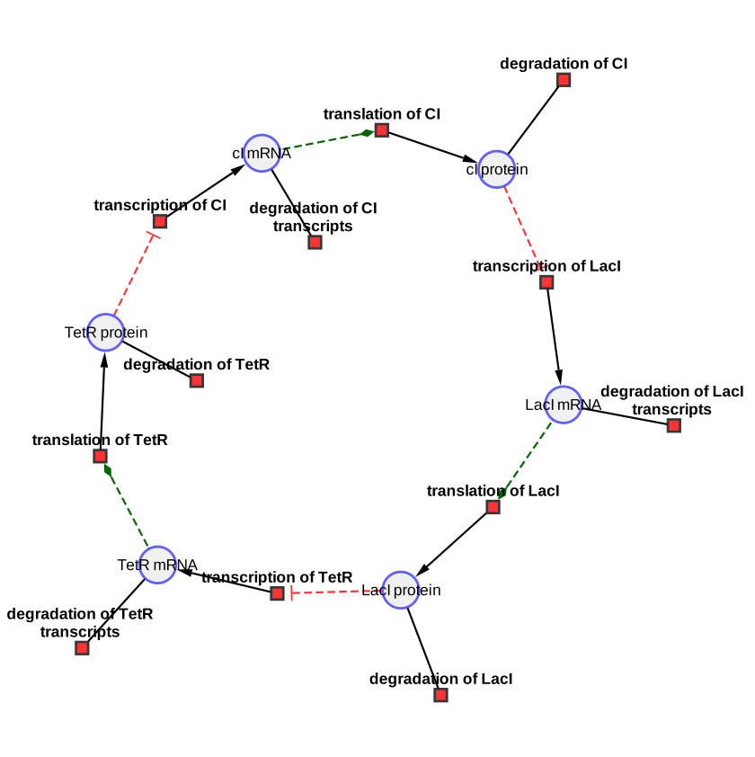

# Styles

cy3sbml adds four visual styles to Cytoscape when it starts:

- `cy3sbml`: a light style, the default,
- `cy3sbml-dark`: the same mappings on a dark background,
- `cy3sbml-layout` and `cy3sbml-dark-layout`: the styles of the layout networks (see
  [Layouts](layouts.md#sbml-layouts)), derived from `cy3sbml` and `cy3sbml-dark`. They have
  the same mappings, with the node width and height from the columns `layout_width` and
  `layout_height`, and draw the compartments as semi-transparent round rectangles behind
  the other nodes, with the label at the top.

A style is only added if Cytoscape has no style with this name yet, so a style you changed
and saved in a session is kept. A missing layout style is derived from the current
`cy3sbml` or `cy3sbml-dark` style, with your changes of that style.

Every imported network view gets the style named by the property `cy3sbml.visualStyle`
(default `cy3sbml`), and the views of the layout networks its layout style (the style
itself if it has no layout style). The property is in the group `cy3sbml.props` of
**Edit → Preferences → Properties...** and is saved in the file
`~/CytoscapeConfiguration/cy3sbml.props`. Set it to `cy3sbml-dark` to use the dark style for
new imports. To change the style of an existing view, select the style in the **Style**
panel of Cytoscape.

{ width="600" }

## Mappings

The styles map the columns of the [network model](network.md) to visual properties:

| Visual property | Column |
|---|---|
| node label | `label` |
| node shape, size, label font and label position | `sbml type` |
| node fill color | `sbml type ext` (reversible and irreversible reactions have different colors) |
| node border color | `compartmentCode` (one color per compartment, for up to 8 compartments) |
| node border line type | `cofactorClone` (dashed for the clones of split cofactor nodes) |
| edge line type and target arrow shape | `interaction type` |
| edge color, source arrow shape and arrow colors | `shared interaction` (activators and inhibitors have their own colors) |

The node label is a passthrough mapping, all other mappings are discrete mappings; the
layout styles add passthrough mappings for the node width and height. You can change the
mappings in the **Style** panel like in any other style, and save the result in your
session.
