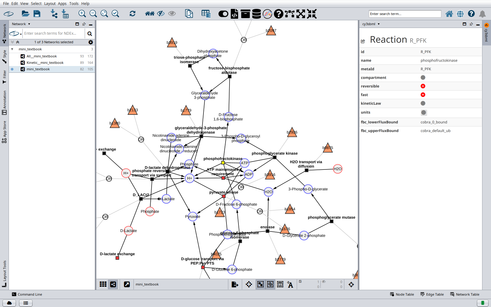

# cy3sbml

cy3sbml is a [Cytoscape](https://cytoscape.org) app that imports models in the
Systems Biology Markup Language ([SBML](https://sbml.org)) as Cytoscape networks.
It reads SBML with [JSBML](https://github.com/sbmlteam/jsbml) and shows the SBML
information and the annotations of the selected object in a panel next to the network.

## Features

- Import of all SBML levels and versions, including the packages `qual`, `fbc`, `comp`,
  `groups`, `distrib` and `layout`. See [Supported SBML packages](guide/packages.md).
- Three networks per model: the reaction network, a kinetic network with parameters,
  rules and kinetic laws, and a network with all SBML objects.
  See [Network model](guide/network.md).
- A panel with the SBML attributes, the annotations, the history and the notes of the
  selected object. Annotations are resolved with the identifiers.org registry, the
  Ontology Lookup Service, UniProt and ChEBI. See
  [Info panel and annotations](guide/info-panel.md).
- Visual styles for SBML networks, a light one and a dark one. See [Styles](guide/styles.md).
- Example models, and search and import of models from
  [BioModels](https://www.biomodels.org). See [Importing SBML](guide/import.md).
- The layouts of the SBML `layout` package as networks with the drawn positions, and
  saving and loading of node positions. See [Layouts](guide/layouts.md).

- Import of the SBML models of COMBINE archives (OMEX). See
  [Importing SBML](guide/import.md#combine-archives).

Not supported yet: a built-in SBML validator. See [Validation](guide/validation.md) and
[Supported SBML packages](guide/packages.md).

## Getting started

1. Install cy3sbml from the Cytoscape App Store, see [Installation](installation.md).
2. Click the **SBML examples** button in the Cytoscape toolbar and load one of the
   example models, or import your own SBML file with **Import SBML**.
3. Select nodes in the network. The **cy3sbml** panel on the right shows the
   information of the selected object.

## Links

- Cytoscape App Store: [apps.cytoscape.org/apps/cy3sbml](https://apps.cytoscape.org/apps/cy3sbml)
- Source code: [github.com/matthiaskoenig/cy3sbml](https://github.com/matthiaskoenig/cy3sbml)
- Bug tracker: [GitHub issues](https://github.com/matthiaskoenig/cy3sbml/issues)
- Changes of every version: [Release notes](release-notes.md)
- How to cite cy3sbml: [Citation](citation.md)
