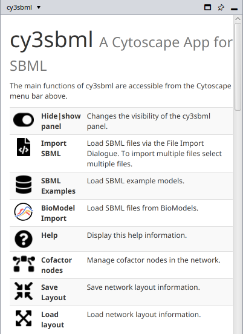

# Installation

## Requirements

cy3sbml runs in Cytoscape 3.10 (it is built against the Cytoscape API 3.10.0 and tested
with Cytoscape 3.10.4). Cytoscape 3.10 runs on Java 17 and ships JavaFX, which the
cy3sbml panel uses. No further software is needed.

Always use the latest release of Cytoscape and of cy3sbml. Bug reports are only handled
for the latest versions.

The annotation lookups in the [info panel](guide/info-panel.md) and the
[BioModels import](guide/import.md#biomodels) need an internet connection. cy3sbml uses
the proxy settings of Cytoscape (**Edit → Preferences → Proxy Settings...**).

## Install from the App Store

The recommended way is the Cytoscape App Store.

**In Cytoscape:**

1. Open **Apps → App Store → Show App Store**.
2. Search for `cy3sbml`.
3. Click **Install**.

**In a web browser:**

1. Start Cytoscape.
2. Open [cy3sbml in the Cytoscape App Store](https://apps.cytoscape.org/apps/cy3sbml).
3. Click **Install**. The App Store installs the app into the running Cytoscape.

After the installation, cy3sbml adds its buttons to the toolbar and the **cy3sbml** panel
to the right side of the Cytoscape window.

{ width="400" }

## Install a jar file

Every release on [GitHub](https://github.com/matthiaskoenig/cy3sbml/releases) has the
app jar `cy3sbml-<version>.jar` with its checksums. To install it:

1. Download `cy3sbml-<version>.jar`.
2. In Cytoscape, open **Apps → App Store → Show App Store**.
3. Click **Install from File...** and select the jar.

Development builds are installed the same way, or with a symbolic link into the Cytoscape
apps folder, see [Building](development/building.md#run-in-cytoscape).

## Update, disable or uninstall

Open **Apps → App Store → Show App Store**, switch to the list of installed apps, select
cy3sbml, and click **Update**, **Disable** or **Uninstall**.

## Files written by cy3sbml

cy3sbml writes its log file and its extracted resources into
`~/CytoscapeConfiguration/cy3sbml/`. The log file is named `cy3sbml-v<version>.log`.
Attach it to bug reports.
